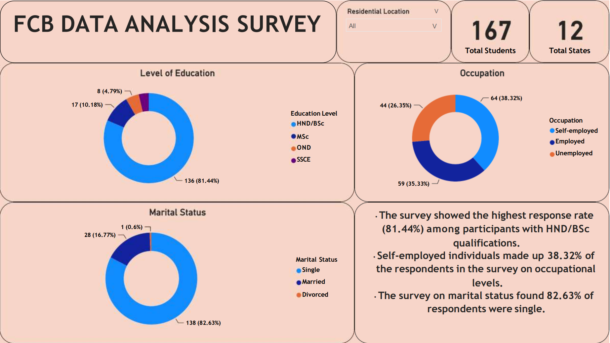

# FCB DTA Class Student Analysis
This report details the analysis of student data from a recent data analyst bootcamp. The objective is to understand the program's demographics and identify any trends or patterns related to student background and participation.
## Project outline
- Data Sources
- Tools Utilized
- Data Analysis
- Data Visualization
- Key Takeaways
- Conclusion
---

## Data Sources
Google Form 

## Tools utilized
- MS Excel ***[Download here](https://www.microsoft.com)***
- MS Power BI
- Google Forms

## Data Analysis

Diving into the bootcamp participant data, I started with demographics.  I was curious about the gender makeup, so I analyzed the percentage of male and female participants. Age was another key factor.  To understand the typical participant age range, I visualized the age distribution with charts. Next, I looked at educational backgrounds. I identified the most common level of education attained by the participants, such as Bachelor's degrees, Master's degrees, or something else entirely. Geographical diversity was also interesting. By exploring the location data, I could see where students were coming from across the country. But it wasn't just about demographics.  I wanted to see if there were any deeper connections. For example, was there a correlation between a participant's highest level of education and their prior occupation? Maybe people with higher degrees came from specific fields. So, I investigated any potential links there. Finally, I considered marital status.  It was worth exploring if there were any trends between being married or single and participation in the bootcamp. This could be a valuable insight for the program in terms of outreach strategies

## Data Visualization

## Key Takeaways
Most survey participants were aged 26 to 35. This 	age group had twice as many respondents (115) 	as all other age groups combined
With 58.08%, males were the majority gender in 	the survey. The peak time of completion of the survey was about 1 minute where about 29 people completed forms within that time span

- The survey showed the highest response rate (81.44%) among participants with HND/BSc qualifications.
- Self-employed individuals made up 38.32% of the respondents in the survey on occupational levels.
- The survey on marital status found 82.63% of 	respondents were single.

## Conclusion

This data analysis provides valuable insights into the demographics and background of the bootcamp participants. Understanding these characteristics can be used to improve the program's outreach strategies, cater to diverse learning styles, and potentially predict student success based on prior qualifications

