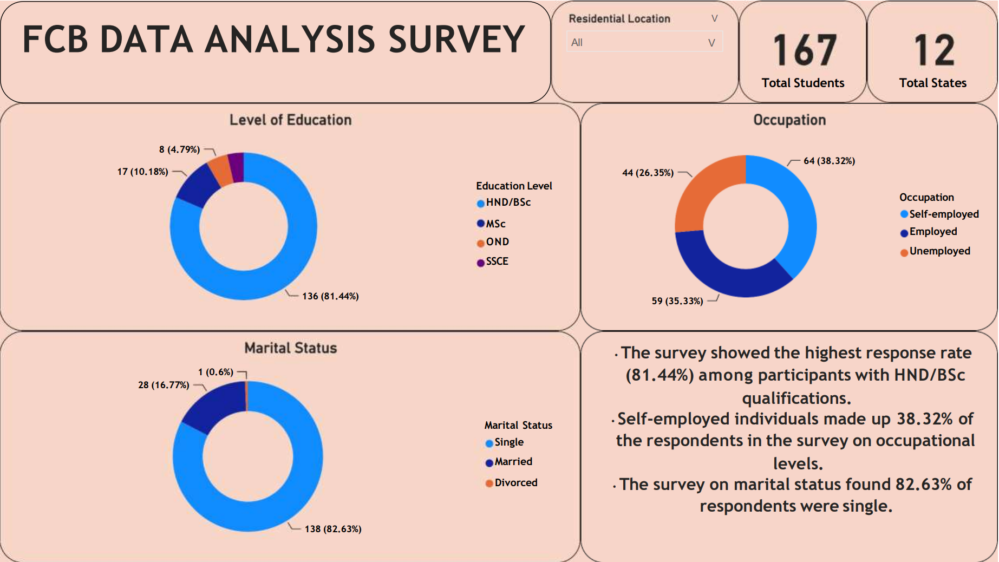

# FCB DTA Class Student Analysis
This report details the analysis of student data from a recent data analyst bootcamp. The objective is to understand the program's demographics and identify any trends or patterns related to student background and participation.
## Project outline
---
Name 
Email address 
Gender
Marital status
Unique code (for internal tracking)
Residential location
Age group
Highest level of education
Occupation

## Data Sources
This is where all sources of data collected are referenced and mentioned  

## Tools utilized
- MS Excel ***[Download here](https://www.microsoft.com)***
- MS Power BI
- Google Forms

## Data Analysis

The data analyzed the percentage of male and female participants and also visualized the age distribution amongst the participant
I was also able to analyze the most common education attainment and explored the geographical location spread of each participants.
I as well Investigate if there was a correlation between a participant's highest level of education and their prior occupation.
The marital status of the participant were also into cosideration as there could be trends between marital status and their participation in the bootcamp.

## Data Visualization

## Key Takeaways
Most survey participants were aged 26 to 35. This 	age group had twice as many respondents (115) 	as all other age groups combined
With 58.08%, males were the majority gender in 	the survey. 2:45 and 2:46 recorded the highest number of 	completed forms, 29 each, totaling at 58.

- The survey showed the highest response rate (81.44%) among participants with HND/BSc qualifications.
- Self-employed individuals made up 38.32% of the respondents in the survey on occupational levels.
- The survey on marital status found 82.63% of 	respondents were single.

## Conclusion

This data analysis provides valuable insights into the demographics and background of the bootcamp participants. Understanding these characteristics can be used to improve the program's outreach strategies, cater to diverse learning styles, and potentially predict student success based on prior qualifications

